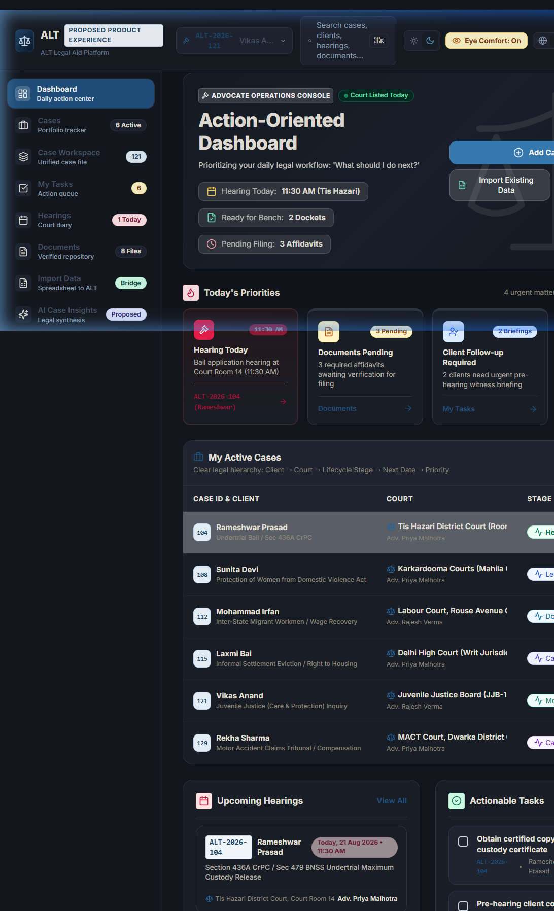
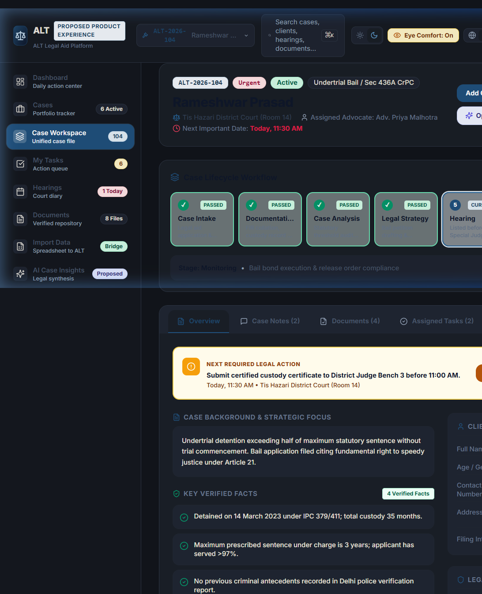
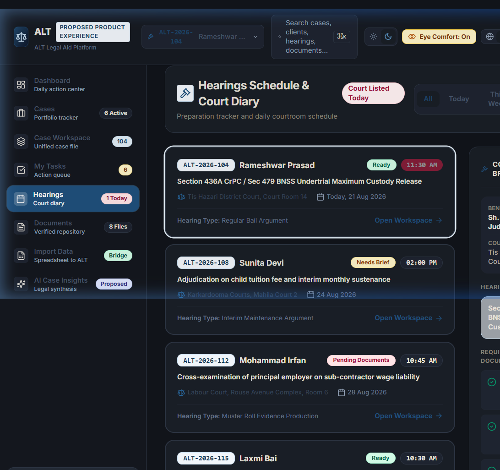
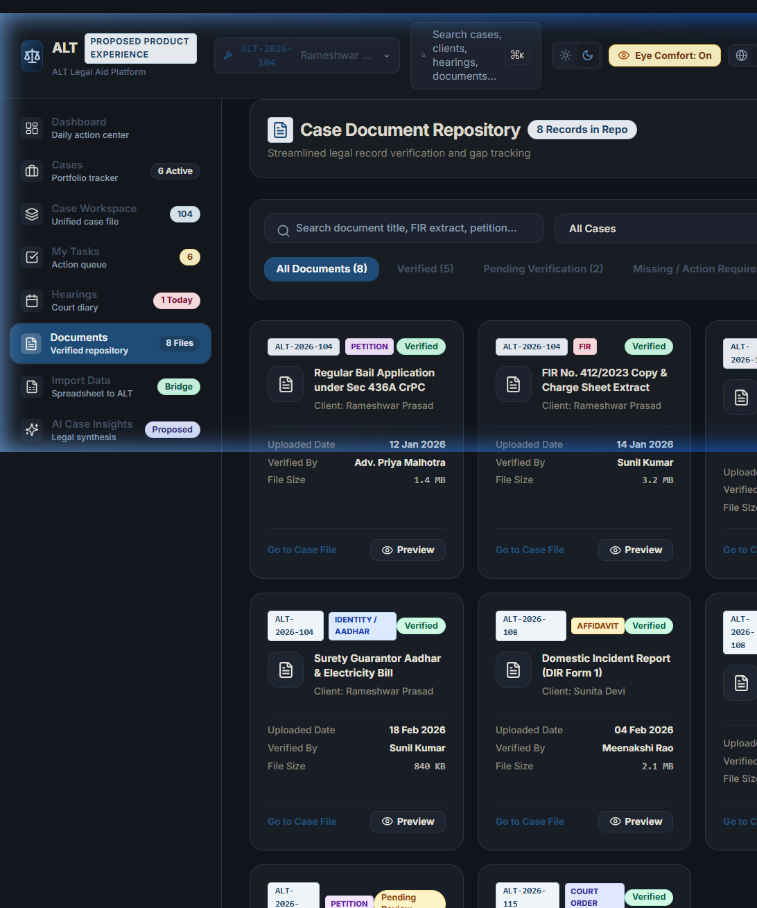
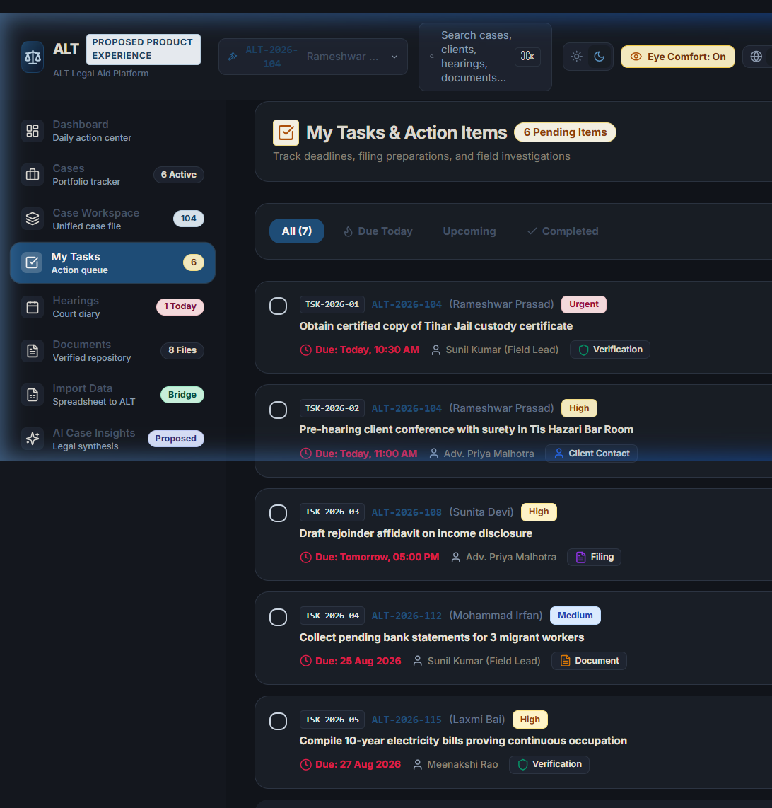
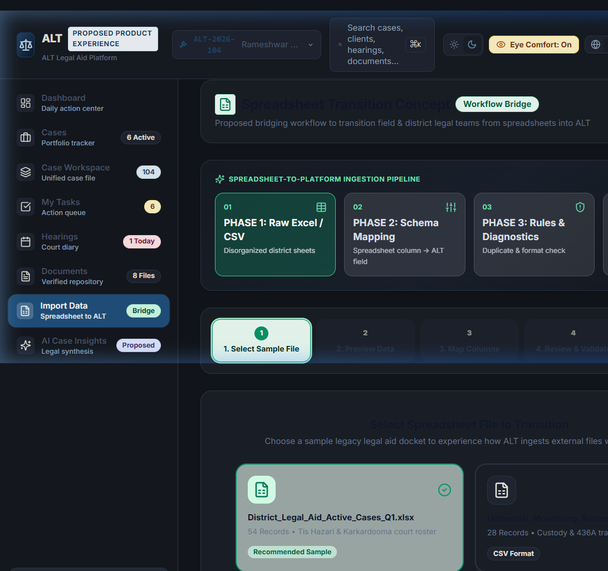
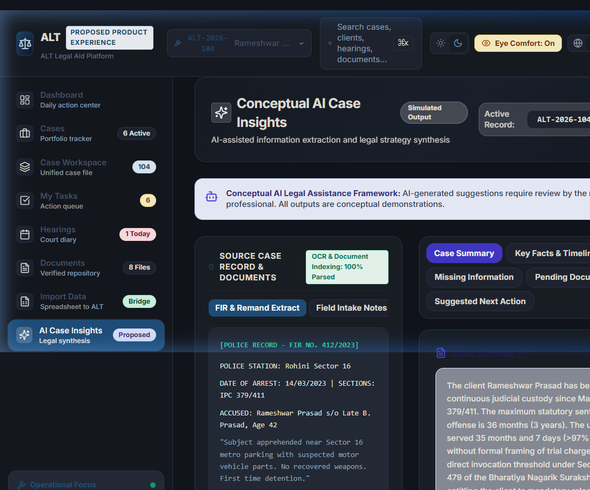
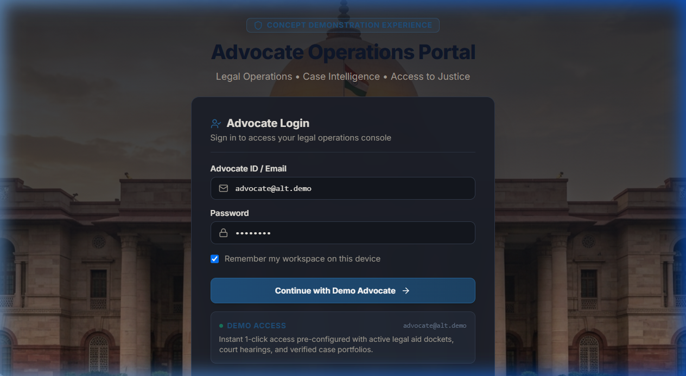

# ALT Legal Aid Platform

> **An integrated legal operations and case progression workspace designed to streamline undertrial defense workflows, eliminate administrative spreadsheet fragmentation, and accelerate bail advocacy across Indian court jurisdictions.**

[](https://alt-legal-aid-platform.vercel.app/)
[](./docs/report/ALT_Legal_Aid_Platform_Strategy_and_Product_Development_Report.pdf)
[](https://github.com/gagandeepsingh76/ALT-Legal-Aid-Platform)

---

## 📌 Quick Access & Project Links

| Resource | Direct Link | Purpose |
| :--- | :--- | :--- |
| 🌐 **Live Web Application** | **[alt-legal-aid-platform.vercel.app](https://alt-legal-aid-platform.vercel.app/)** | Interactive demonstration deployed on high-availability cloud CDN |
| 📄 **Strategy & Pilot Report** | **[View Final Strategy PDF (11 Pages)](./docs/report/ALT_Legal_Aid_Platform_Strategy_and_Product_Development_Report.pdf)** | Formal 4-week pilot, adoption bridge, metrics & decision framework |
| 💻 **Source Code Repository** | **[github.com/gagandeepsingh76/ALT-Legal-Aid-Platform](https://github.com/gagandeepsingh76/ALT-Legal-Aid-Platform)** | Open-source React, TypeScript & Tailwind CSS implementation |

---

## 📖 Project Overview

The **ALT Legal Aid Platform — Proposed Product Experience** is an independently engineered product prototype and implementation demonstration developed as part of a formal **Product Adoption and 4-Week Pilot Strategy**.

In Indian legal aid operations — particularly across high-volume prison complexes such as Delhi's Tihar, Rohini, and Mandoli — legal defense teams split their working reality between physical prison *mulakat* visitor rooms, busy district courtrooms, and desk-based case coordination. While digital platforms offer immense theoretical value, ground teams often default to disconnected spreadsheets, physical pocket notebooks, and fragmented phone logs under daily court deadline pressures.

This prototype demonstrates how the strategic recommendations from the accompanying strategy report can be operationalized into a **fast, intuitive, and human-centered digital workspace** that respects field habits while unlocking immediate operational value for advocates, social workers, and coordinators.

```
                    ┌──────────────────────────────────────────────┐
                    │       DEMO ADVOCATE AUTHENTICATION           │
                    │      Supreme Court Visual Transition         │
                    └──────────────────────┬───────────────────────┘
                                           │
                                           ▼
                    ┌──────────────────────────────────────────────┐
                    │         EXECUTIVE DASHBOARD HUB              │
                    │  Today's Priorities • Hearing Alert Counter  │
                    └──────────────────────┬───────────────────────┘
                                           │
         ┌─────────────────────────────────┼─────────────────────────────────┐
         ▼                                 ▼                                 ▼
┌──────────────────┐             ┌──────────────────┐             ┌──────────────────┐
│  CASE WORKSPACE  │             │  DAILY OPERATIONS│             │ TRANSITION TOOLS │
│ 6-Stage Stepper  │             │ Hearings Diary   │             │ 5-Step Ingestion │
│ Docket Timeline  │             │ Task Queue       │             │ AI Case Insights │
│ Docs Checklist   │             │ Document Vault   │             │ Precedent Search │
└──────────────────┘             └──────────────────┘             └──────────────────┘
```

---

## 🖼️ Platform Preview & Visual Showcase

### 1. Executive Operations Dashboard
The centralized cockpit for daily legal triage, organizing immediate court priorities (*Hearing Today*, *Documents Pending*, *Client Follow-ups*, *Case Updates*), active case dockets, and upcoming court dates.



---

### 2. Case Workspace & 6-Stage Lifecycle Tracking
Deep dive into flagship case **ALT-2026-104** (*Rameshwar Prasad — Section 436A CrPC / 479 BNSS Undertrial Bail*), featuring a connected 6-stage lifecycle stepper, case notes timeline, and 9-point verification checklist.



---

### 3. Courtroom Hearings Diary & Preparation Briefs
Court diary schedule categorized by *Today*, *This Week*, and *Upcoming* with judge bench details, courtroom briefs, and essential filing checklists.



---

### 4. Categorized Document Repository
Categorized vault tracking *Verified*, *Pending Review*, and *Action Required* case documents with instant modal inspection.



---

### 5. Actionable Task Queue
Role-organized task management with quick-filter categories (*Due Today*, *Upcoming*, *Overdue*, *Completed*) and instant status toggles.



---

### 6. Spreadsheet-to-Platform Ingestion Wizard
A non-disruptive 5-step transition pipeline (Upload &rarr; Preview &rarr; Column Mapping &rarr; Diagnostic Validation &rarr; Ingestion) allowing ground teams to migrate legacy Excel sheets without data loss.



---

### 7. AI Case Insights & Analytical Synthesis
Split-view legal intelligence workspace: realistic source documents (police FIR transcripts, intake records) on the left paired with structured legal synthesis (Summary, Key Facts, Important Dates, Missing Information, and Statutory Bail Precedents) on the right.



---

### 8. Institutional Login Experience
Advocate access portal with 1-click Demo Advocate authentication, appearance controls, language switcher, and Supreme Court transition.



---

## 🎯 Strategy to Product Mapping

The following matrix illustrates how the strategic recommendations formulated in the strategy report were translated into functional product capabilities:

| Strategic Recommendation | Prototype Implementation | Intended Operational Benefit |
| :--- | :--- | :--- |
| **Centralized Operational Visibility** | **Executive Dashboard** with priority action cards, active docket summaries, and urgent focus indicators | Eliminates fragmented tracking across multiple disparate spreadsheets and notebooks |
| **Structured Case Workflow** | **Unified Case Workspace** with 6-stage lifecycle progression, case details, notes timeline, and audit logs | Provides a single, unambiguous operational view of every active undertrial file |
| **Hearing & Deadline Visibility** | **Dedicated Hearings Interface** with bench briefs, courtroom numbers, and *"Hearing Today"* alerts | Prevents missed court dates and accelerates hearing preparation |
| **Document Workflow & Integrity** | **Document Repository** with categorical verification statuses (*Verified*, *Pending*, *Missing*) | Makes filing readiness transparent to advocates and social workers |
| **Non-Disruptive Data Migration** | **5-Step Spreadsheet Import Wizard** with automated column-to-field mapping and diagnostic error checks | Establishes a safe bridge for moving legacy spreadsheets into ALT without workflow disruption |
| **AI-Assisted Legal Operations** | **AI Case Insights** pairing raw case records with structured synthesis under advocate supervision | Saves 2–3 hours of manual petition drafting per case while maintaining legal oversight |
| **Bilingual Accessibility & Usability** | **English / हिंदी Localization** + **Tri-Mode Appearance Engine** (Light, Dark, Eye Comfort) | Accommodates diverse language preferences and eliminates eye strain during long reading hours |

---

## ✨ Core Product Capabilities

* 🏛️ **Executive Dashboard**: Real-time caseload tracking, daily priority alerts, and court diary schedule.
* 📂 **Unified Case Workspace**: Full 360° view of case details, statutory bail eligibility (Section 436A CrPC / 479 BNSS), and 6-stage lifecycle stepper.
* ⚖️ **Hearings Diary**: Real-time courtroom calendar with bench composition, filing readiness checks, and urgency tags.
* ✅ **My Tasks**: Actionable queue for field associates and lawyers with instant completion tracking.
* 📄 **Document Vault**: Centralized document management with verification status markers and modal previews.
* 📊 **Spreadsheet Bridge**: 5-step guided wizard for seamless migration from Excel/Google Sheets to structured platform data.
* 🤖 **AI Case Insights**: Source document OCR inspection, automatic charge extraction, timeline generation, and legal precedent citations.
* 🌐 **Bilingual English & हिंदी**: Full bilingual interface utilizing localized legal terminology and protective `Noto Sans Devanagari` typography.
* 🌗 **4-State Appearance Engine**:
  * **Light Mode**: Crisp, high-contrast institutional slate/white surfaces.
  * **Light + Eye Comfort**: Warm ivory/linen surfaces (`#f7f3ea`) with soft dark text for daytime glare reduction.
  * **Dark Mode**: Deep midnight navy surfaces (`#0a0f1d`) with high-contrast text.
  * **Dark + Eye Comfort**: Warm charcoal surfaces (`#1b2029`) with warm cream typography for late-night court drafting.
* 🔍 **Global Command Search**: Quick search modal (`⌘K` / `Ctrl+K`) for instantaneous lookup across cases, clients, and court dates.

---

## 🛠️ Technology Stack

| Domain | Technology | Description |
| :--- | :--- | :--- |
| **Framework** | **React 18** | Functional component architecture with React hooks |
| **Language** | **TypeScript** | Type-safe data models, interfaces, and component props |
| **Build Tool** | **Vite 6** | Fast module bundler and development server |
| **Styling** | **Tailwind CSS + Custom CSS Variables** | Semantic design tokens supporting 4-state appearance architecture |
| **Typography** | **Google Fonts** | `Inter`, `Plus Jakarta Sans`, and `Noto Sans Devanagari` |
| **Icons** | **Lucide React** | Consistent legal and operational domain iconography |
| **State Management** | **React Context API + LocalStorage** | Zero-backend client architecture with persistent theme, language, and session state |
| **Deployment** | **Vercel** | Edge-network global CDN deployment |

---

## 📁 Repository Structure

```
ALT-Legal-Aid-Platform/
├── docs/
│   ├── report/
│   │   ├── ALT_Legal_Aid_Platform_Strategy_and_Product_Development_Report.pdf  <-- Final Strategy Report
│   │   └── ALT_Legal_Aid_Platform_Strategy_and_Product_Development_Report.html <-- HTML Report Source
│   └── images/
│       ├── login-page.png
│       ├── dashboard.png
│       ├── case-workspace.png
│       ├── hearings.png
│       ├── tasks.png
│       ├── documents.png
│       ├── spreadsheet-import.png
│       └── ai-case-insights.png
├── src/
│   ├── assets/             # Institutional imagery (Supreme Court transition)
│   ├── components/
│   │   ├── ai/             # AI Case Insights split-view interface
│   │   ├── auth/           # Login & Demo authentication views
│   │   ├── cases/          # Case Inventory & Case Workspace views
│   │   ├── dashboard/      # Executive Dashboard & Priority cards
│   │   ├── documents/      # Categorized document repository
│   │   ├── hearings/       # Courtroom diary & bench briefs
│   │   ├── import/         # 5-step spreadsheet ingestion wizard
│   │   ├── layout/         # Header, Sidebar, Disclaimer banner
│   │   ├── modals/         # Global search & case update dialogs
│   │   └── tasks/          # Actionable task management queue
│   ├── context/            # Global AppContext (Theme, Language, Active Case)
│   ├── data/               # Static legal mock data (flagship cases, dockets, tasks)
│   ├── i18n/               # Bilingual localization dictionary (EN & HI)
│   ├── types/              # TypeScript domain types & interfaces
│   ├── App.tsx             # Root routing & layout orchestrator
│   ├── index.css           # Global CSS variables, theme classes & Devanagari rules
│   └── main.tsx            # Application entry point
├── package.json
├── tailwind.config.js
├── tsconfig.json
├── vite.config.ts
└── README.md
```

---

## 🚀 How to Run Locally

### Prerequisites
* **Node.js** (v18.0.0 or higher recommended)
* **npm** (v9.0.0 or higher)

### 1. Clone Repository
```bash
git clone https://github.com/gagandeepsingh76/ALT-Legal-Aid-Platform.git
cd ALT-Legal-Aid-Platform
```

### 2. Install Dependencies
```bash
npm install
```

### 3. Start Local Development Server
```bash
npm run dev
```
Open your browser and navigate to `http://localhost:5173`.

### 4. Build for Production
```bash
npm run build
```

### 5. Preview Production Bundle
```bash
npm run preview
```

---

## 📄 Strategy & Product Development Report

This repository is accompanied by a formal 11-page strategy and product development report:

* **Document:** [`docs/report/ALT_Legal_Aid_Platform_Strategy_and_Product_Development_Report.pdf`](./docs/report/ALT_Legal_Aid_Platform_Strategy_and_Product_Development_Report.pdf)
* **Executive Scope:**
  1. **Executive Summary**: Core mission and North Star target (*1,000,000 Days of Incarceration Saved*).
  2. **Understanding the Current Platform**: Empirical baseline analysis of the live system (`altindia.base44.app/demo`).
  3. **The Product Adoption Problem**: Operational gap between desktop software and field reality.
  4. **Why Adoption Is Currently Low**: 4 systemic root causes (field security, dual-entry, value latency, cognitive overload).
  5. **Proposed Adoption Strategy**: The "Value-First, Zero-Friction" adoption bridge.
  6. **Role-Based Workflow Integration**: Tailored daily journeys for Field Associates, Social Workers, and Legal Associates.
  7. **Four-Week Pilot Plan**: Phased rollout schedule (Baseline &rarr; Workflow &rarr; Value &rarr; Scale).
  8. **Spreadsheet Transition Strategy**: 3-stage controlled sunsetting model.
  9. **Adoption Rituals & Feedback Loop**: Three micro-rituals (<20 mins/day) and rapid friction logging.
  10. **Success Metrics & Evaluation Framework**: Target KPIs vs. verified baselines.
  11. **Go / Modify / Stop Decision Framework**: Quantitative thresholds for scale, extension, or pilot reset.
  12. **Product Prototype & Implementation Demonstration**: Direct strategy-to-product mapping with live deployment proof.
  13. **Conclusion & Synthesis**: Executive strategy synthesis.

---

## ⚖️ Scope & Attribution Disclaimer

> **Implementation Disclaimer & Epistemic Boundaries:**  
> This repository contains an independently developed product prototype and implementation demonstration created as part of a **Strategy & Product Development Assignment**. It is intended to demonstrate the practical operationalization of the strategic and product recommendations presented in the accompanying report. It should **not** be represented as the official production platform of Project ALT or as evidence of completed organizational adoption.

---

**Prepared by:** Gagandeep Singh  
**Assignment:** Strategy & Product Development Assignment  
**Date:** August 2026  
